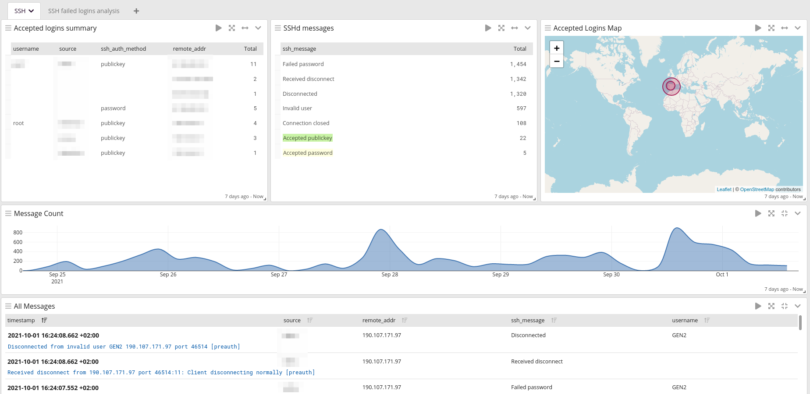
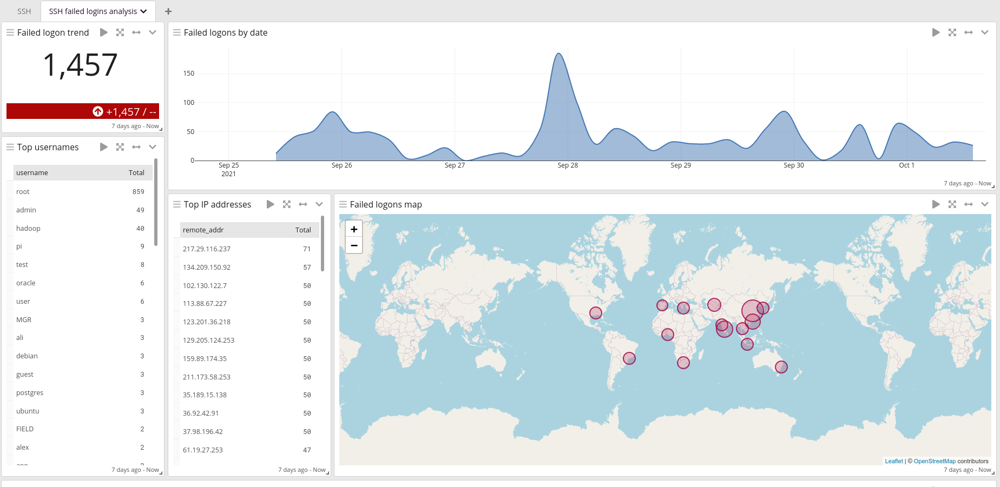

# Graylog 4.1 SSH
Graylog OpenSSH log parser and dashboards, based on @Trogper [graylog ssh extractor](https://github.com/trogper/graylog-ssh-extractor)

## Requeriments
* Forward OpenSSH logs using syslog
* Parse logs from a Graylog syslog input message
* To have maps working, ensure that the `GeoIP Resolver` processor is enabled after `Pipeline Processor`

